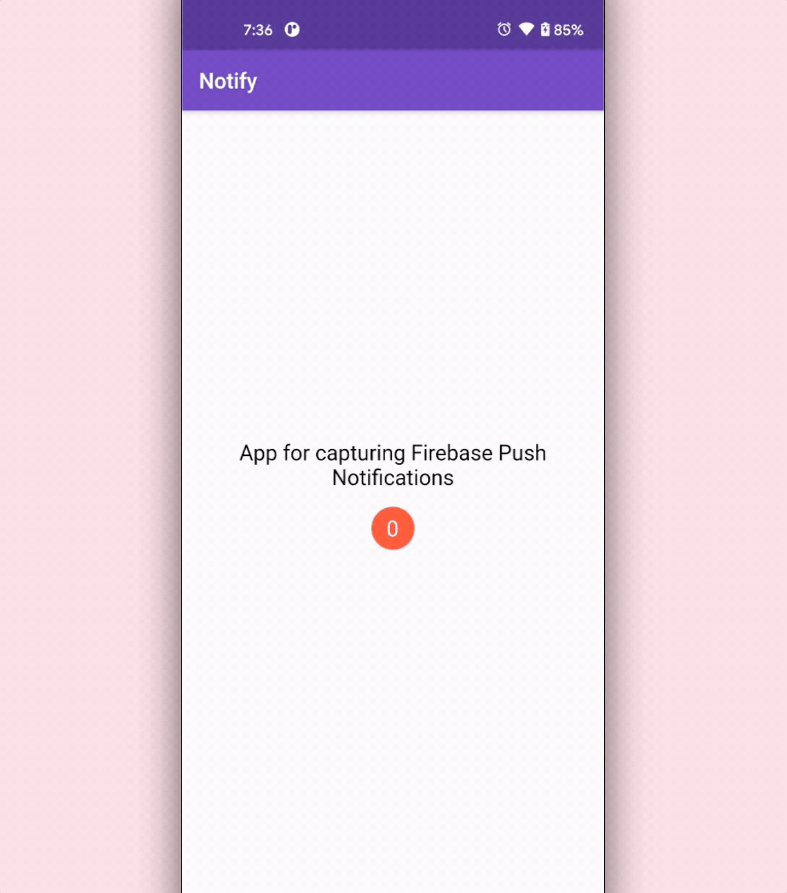
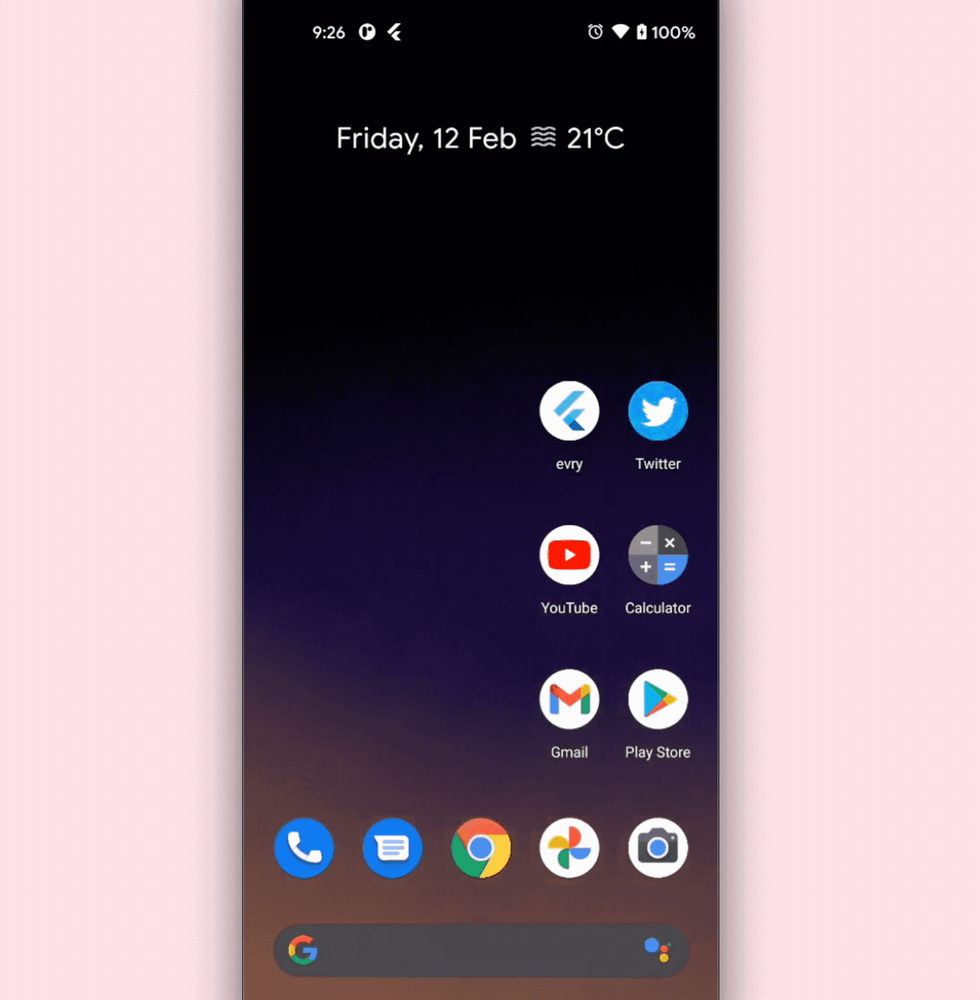

# Notify

A Flutter sample app demonstrating how to send push notifications using **Firebase Cloud Messaging (FCM)**.

## Screenshots

Notification while the app is running in the **foreground**:



Notification while the app is running in the **background**:



## Plugins

The Flutter plugins used in this project are as follows:

- [firebase_core](https://pub.dev/packages/firebase_core), which is required to use any Firebase service with Flutter
- [firebase_messaging](https://pub.dev/packages/firebase_messaging), which is used for receiving notifications in the app
- [overlay_support](https://pub.dev/packages/overlay_support), which builds overlay UI

Add the following to your `pubspec.yaml` file:

```yaml
dependencies:
  firebase_core: ^1.2.0
  firebase_messaging: ^10.0.0
  overlay_support: ^1.2.1
```

## Usage

In order to run this project, you have to follow the steps below:

1. Clone the project:
   
   ```bash
   git clone https://github.com/sbis04/notify.git
   ```

2. Complete Firebase project setup for both **Android** & **iOS** platforms by going to the [Firebase console](https://console.firebase.google.com/).

3. For running on **iOS**, you have to do some configurations from Xcode. Follow the guide [here](https://firebase.flutter.dev/docs/messaging/apple-integration).

3. Get Flutter packages:
   
   ```bash
   flutter pub get
   ```

4. Run the app:
   
   ```bash
   flutter run
   ```

## License

Copyright (c) 2021 Souvik Biswas

Permission is hereby granted, free of charge, to any person obtaining a copy
of this software and associated documentation files (the "Software"), to deal
in the Software without restriction, including without limitation the rights
to use, copy, modify, merge, publish, distribute, sublicense, and/or sell
copies of the Software, and to permit persons to whom the Software is
furnished to do so, subject to the following conditions:

The above copyright notice and this permission notice shall be included in all
copies or substantial portions of the Software.

THE SOFTWARE IS PROVIDED "AS IS", WITHOUT WARRANTY OF ANY KIND, EXPRESS OR
IMPLIED, INCLUDING BUT NOT LIMITED TO THE WARRANTIES OF MERCHANTABILITY,
FITNESS FOR A PARTICULAR PURPOSE AND NONINFRINGEMENT. IN NO EVENT SHALL THE
AUTHORS OR COPYRIGHT HOLDERS BE LIABLE FOR ANY CLAIM, DAMAGES OR OTHER
LIABILITY, WHETHER IN AN ACTION OF CONTRACT, TORT OR OTHERWISE, ARISING FROM,
OUT OF OR IN CONNECTION WITH THE SOFTWARE OR THE USE OR OTHER DEALINGS IN THE
SOFTWARE.
